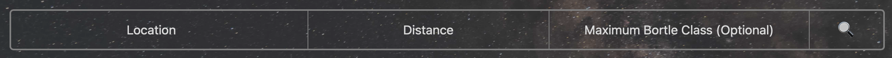
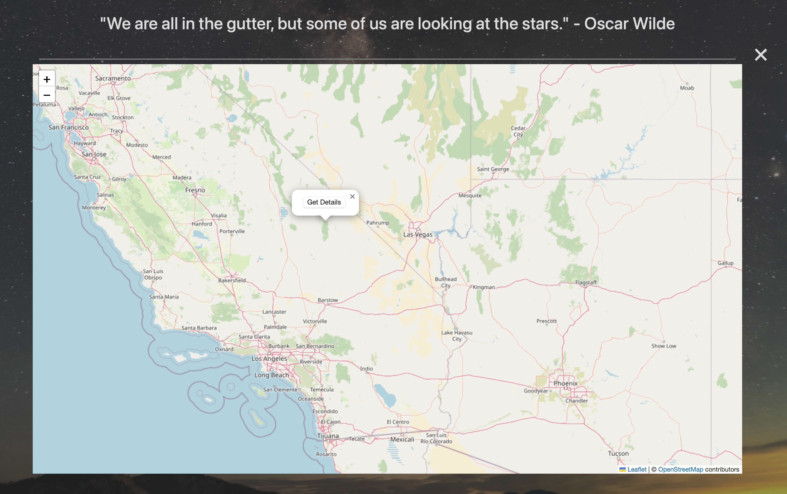
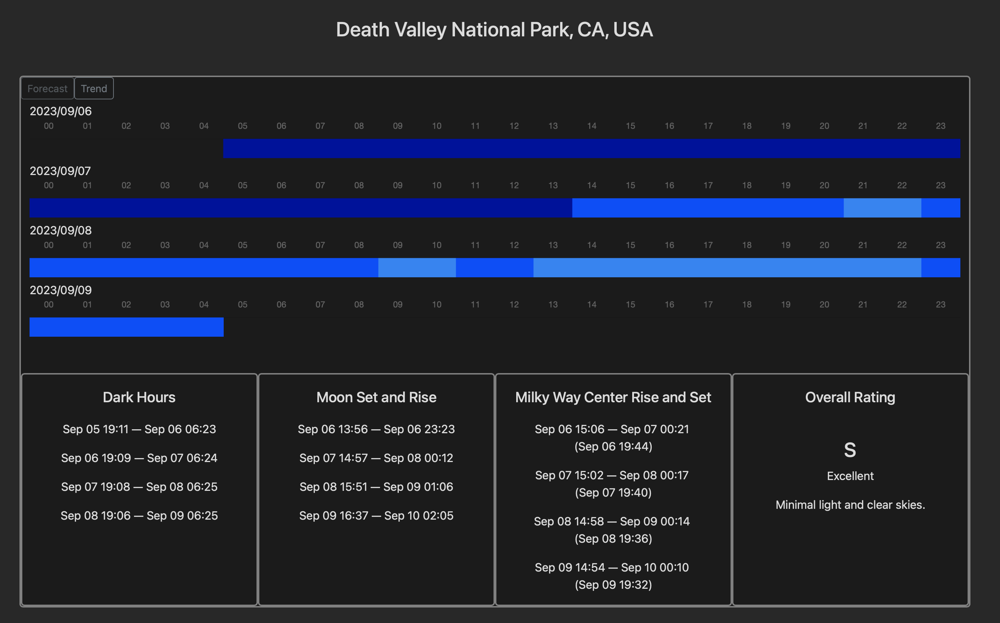
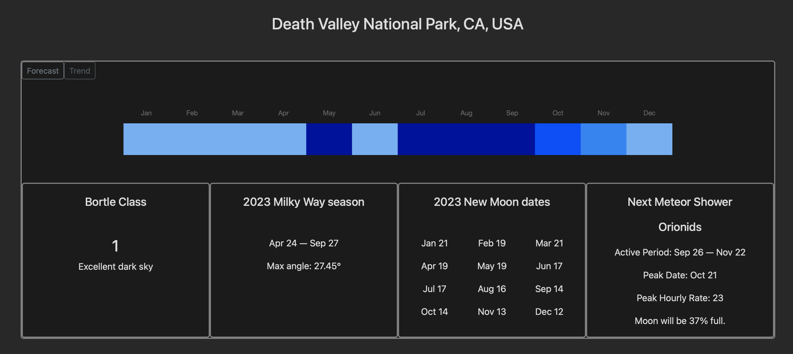

# Starchasers: Find Your Favorite Stargazing Spot

>**NOTE**: This is a public testing version featuring 431 parks from [The National Park Service](#acknowledgements). Currently, park search is limited to the US. We are continuously adding more parks.

## Introduction
One question I see people ask all the time is: I live at xxx, what are the best stargazing locations near me? Or, I just moved to xxx, where can I go for stargazing on weekends? Starchasers is here to answer these questions.

The main utility of Starchasers is working as a search engine that helps you find the best stargazing locations near you and that provides detailed information about these locations. For each location, it provides 72-hour sky transparency forecasts, which are updated *four* times a day,  monthly historical transparency data, which summarizes how transparency is *usually* like in each month,  along with other useful auxiliary information.

Intended users of Starchasers are astronomy enthusiasts and casual stargazers who go stargazing as a hobby or who would like to incorporate stargazing into their travel plans, although stargazers on the more professional end may also find it insightful. An enthusiast who knows virtually nothing about astronomy but just wants to appreciate the beauty of stars and the Milky Way could benefit from the rating system in the detail page by simply going to the place with the highest rating near them. An amateur could further explore the forecast system, narrowing down their observing windows to hours. A more professional astronomer/astrophotographer could augment their experience by the axuiliary information provided, getting an ideal shot of the Millky Way center when it is at the highest altitude.

Welcome, everyone, to the commencement of a wonderful journey.

## Search

Starchasers has two search modes - by user input and by exploring on a map.

### Search by User Input

Searching by user input is pretty straightforward - simply enter a location as the center and select a distance as the radius. A maximum Bortle class can also be optionally set. Then it will return a list of parks within this range that satisfy the maximum Bortle condition if it has been specified.

Q: What are the parks?

A: Parks are a crucial part of Starchasers, which are popular, established nature recreation areas. Including popular parks only in the database makes Starchasers more beginner-friendly, since it is usually a good idea to begin stargazing in well-established areas, e.g. national parks in the US, as opposed to the middle of nowhere.

Q: There are only a few selections for distance. What if I want to set an even larger radius?

A: The last means of transportation for stargazing is almost always cars. And 500 miles (800 kilometers) one-way is usually considered the longest distance one could drive in practice. It makes more sense to update the search location to be closer to your destination rather than setting an impractically long search distance.

For instance, you live in New York City and are traveling to Los Angeles for vacation and you want to find stargazing locations near Los Angeles. Instead of setting location as New York City with a distance of 3000 miles, you should set location as Los Angeles with a distance of, say, 300 miles.

### Search by Exploring the Map

Stargazing at well-established areas such as national parks is safer and more beginner-friendly, but we cannot ignore the beauty that is around us. Perhaps we all know some local go-to's for an easy weekend get-away, and these locations are far less famous than national parks and are thus not included in the database.

To get information on these locations, or practically any location in the world, you could open up the map, select a point, and get the same forecast and historical data.

## Details

A details page mainly focuses on the transparency of the location, where the forecasts page provides transparency forecasts for the following 72 hours, and the trend page provides *typical* transparency data obtained from historical observations. Hovering over a block will display the breakdown values of different factors.

### Forecasts

**Main data**: 72-hour sky transparency forecasts.

**Auxiliary information**:

Dark Hours - sunset to sunrise.

Moon Set and Rise: moon set to moon rise. **We want minimal moonlight for stargazing**, so if a moon rise time is in early evening or a moon set time is in early morning, it means the moon is mostly visible throughout the night, which is bad for stargazing.

Milky Way Center Rise and Set - Milky Way center rise to set (**note the reversed order**). Times in parentheses are transit times, when the Milky Way center reaches its highest altitude in the sky.

Overall Rating - a rating for stargazing conditions. Possible values are S, A, B, and C, with S being excellent and C being poor. ***Note***: This is calculated based on a fairly subjective algorithm, so users with knowledge in astronomy are encouraged to make their own judgment according to data provided. Users who rely on this rating should aim for either S or A, as they provide the best chance of a good condition and the difference between B and C can sometimes be ambiguous.

### Trend

**Main data**: typical (median) transparency of each month. It could be useful if you are planning a trip far ahead.

**Auxiliary information**:

Bortle Class: a metric of light pollution, lower means less light pollution and is therefore better.

Milky Way Season of the year: the first time Milky Way center rises above horizon before midnight to the first time Milky Way center sets below horizon before midnight. Essentially this is the window that you could spot Milky Way center before midnight. It is surely possible to spot Milky Way center outside this window, but you would just need to stay up late. Milky Way season is defined this way to better reflect the beginner-friendly principle.

New Moon Dates of the year: dates that the sky is completely unaffected by the Moon. A couple days (usually within 5) before and after these dates also have minmal moonlight.

Next Meteor Shower: next ***class I*** meteor shower, whose hourly rate (ZHR) is at least 10.

## Contact & Feedback

Starchasers and its data server are both open-source. Feel free to browse the code here: <a href="https://github.com/wmarcoyu/starchasers">Starchasers</a>, <A href="https://github.com/wmarcoyu/starchasers-dataserver">data server</a>

### For the General Public

If you have any comments, suggestions, or feedback, feel free to email me at <a href="mailto:starchasers.info@gmail.com">starchasers.info@gmail.com</a>.

### For Developers

#### Bugs

If you find a bug, you could email me at <a href="mailto:starchasers.info@gmail.com">starchasers.info@gmail.com</a>, open an issue, or make a pull request on GitHub.

#### Database Expansions

`parks` is a crucial database for Starchasers, since the fundamental question Starchasers attempts to answer is "where can I go stargazing". Having more parks in the database means better search results for beginners. Thus, the expansion of this database will be the primary focus of future updates.

Input datasets should be ***shapefiles*** to be sucessfully processed and added to the database. A directory that contains a complete set of shapefiles should include the following five files: .cpg, .dbf, .prj, .shp, and .shx. If you have found a good source that you want to add to the database, please either send me the source via email or open an issue on GitHub. Making a pull request is generally discouraged since different shapefiles have different structures, so that each source needs to be processed individually. Because of the open-source nature of Starchasers, only open-source datasets will be accepted.

`cities` database is used for location search. There is no plan to expand this database as it already contains more than 40,000 world cities with a unique database structure. If searching for a small town shows no results, trying a larger city nearby should work.

## Acknowledgements

Written by <a href="https://github.com/wmarcoyu">Yu Wang</a>, summer 2023.

 This work is licensed under a <a rel="license" href="http://creativecommons.org/licenses/by-nc/4.0/">Creative Commons Attribution-NonCommercial 4.0 International License</a>.

### Attributions

**Light pollution map to determine Bortle classes**: Falchi, Fabio; Cinzano, Pierantonio; Duriscoe, Dan; Kyba, Christopher C. M.; Elvidge, Christopher D.; Baugh, Kimberly; Portnov, Boris; Rybnikova, Nataliya A.; Furgoni, Riccardo (2016): Supplement to: The New World Atlas of Artificial Night Sky Brightness. V. 1.1. GFZ Data Services.
<a href="https://doi.org/10.5880/GFZ.1.4.2016.001">https://doi.org/10.5880/GFZ.1.4.2016.001</a>

**Meteorological data for calculating transparency forecasts and trends**:

NOAA Global Forecast System (GFS) was accessed from
<a href="https://registry.opendata.aws/noaa-gfs-bdp-pds">https://registry.opendata.aws/noaa-gfs-bdp-pds</a>

NOAA Global Ensemble Forecast System (GEFS) was accessed from
<a href="https://registry.opendata.aws/noaa-gefs">https://registry.opendata.aws/noaa-gefs</a>

**World cities database for location search**:
<a href="https://simplemaps.com/data/world-cities">https://simplemaps.com/data/world-cities</a>

**Shapefile sources for `parks` database**:

US National Park Service (NPS):
<a href="https://public-nps.opendata.arcgis.com/datasets/nps::nps-boundary-4/explore">https://public-nps.opendata.arcgis.com/datasets/nps::nps-boundary-4/explore</a>
